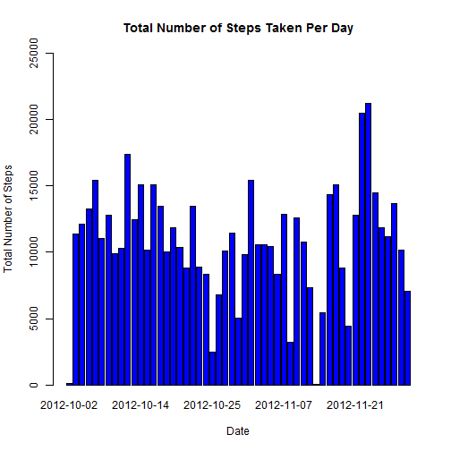
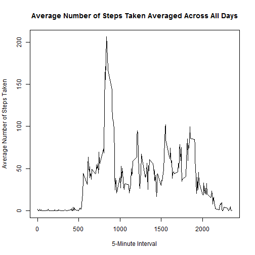
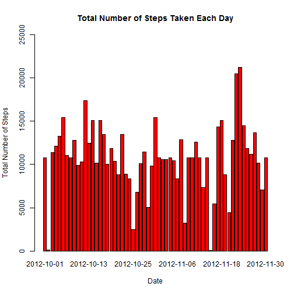
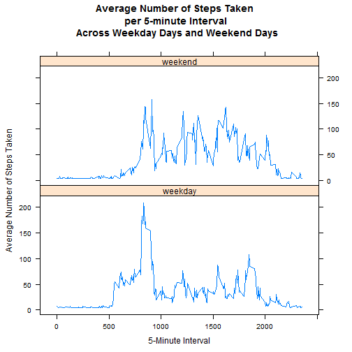

## Introduction

This assignment makes use of data from a personal activity monitoring device. This device collects data at 5 minute intervals through out the day. The data consists of two months of data from an anonymous individual collected during the months of October and November, 2012 and include the number of steps taken in 5 minute intervals each day.

### Loading and preprocessing the data

* Download and unzipped the data to the working directory.
* Set the current working directory to your working directory. For example, use setwd() function.

Load the data in RStudio

```r
amd <- read.csv("activity.csv", header=T, sep=",")
```

Check the dataframe

```r
head(amd)
```

```
##   steps       date interval
## 1    NA 2012-10-01        0
## 2    NA 2012-10-01        5
## 3    NA 2012-10-01       10
## 4    NA 2012-10-01       15
## 5    NA 2012-10-01       20
## 6    NA 2012-10-01       25
```

### What is mean total number of steps taken per day?

###### For this part, ignore the missing values in the dataset.
1. Make a histogram of the total number of steps taken each day


```r
## Calculate the total number of steps taken per day and remove the  missing value
total_steps <- aggregate(steps ~ date, amd, sum, na.rm=TRUE)

## Check the dataframe
head(total_steps)
```

```
##         date steps
## 1 2012-10-02   126
## 2 2012-10-03 11352
## 3 2012-10-04 12116
## 4 2012-10-05 13294
## 5 2012-10-06 15420
## 6 2012-10-07 11015
```

Make a histogram of the total number of steps taken each day.

```r
barplot(total_steps$steps, names.arg=total_steps$date, ylim=c(0, 25000), 
        xlab="Date", ylab="Total Number of Steps", 
        main = "Total Number of Steps Taken Per Day",col="blue")
```



2. Calculate and report the mean and median of the total number of steps taken per day

Mean of the total number of steps taken per day

```r
mean(total_steps$steps, na.rm=TRUE)
```

```
## [1] 10766.19
```

Median of the total number of steps taken per day

```r
median(total_steps$steps, na.rm=TRUE)
```

```
## [1] 10765
```

### What is the average daily activity pattern?
1. Make a time series plot (i.e. type = "l") of the 5-minute interval (x-axis) and the average number of steps taken, averaged across all days (y-axis)


```r
## Calculate  the average number of steps taken, averaged across all days
avg_steps <- aggregate(steps ~ interval, amd, mean, na.rm=TRUE)

## Check the dataframe
head(avg_steps)
```

```
##   interval     steps
## 1        0 1.7169811
## 2        5 0.3396226
## 3       10 0.1320755
## 4       15 0.1509434
## 5       20 0.0754717
## 6       25 2.0943396
```

Make a time series plot of the 5-minute interval 

```r
plot(y=avg_steps$steps, x=avg_steps$interval, xlab="5-Minute Interval", 
     ylab="Average Number of Steps Taken", 
     main = "Average Number of Steps Taken Averaged Across All Days", type="l")
```



2. Which 5-minute interval, on average across all the days in the dataset, contains the maximum number of steps?

The 5-minute interval contains the maximum number of steps

```r
avg_steps[avg_steps$steps==max(avg_steps$steps),]
```

```
##     interval    steps
## 104      835 206.1698
```

### Imputing missing values
1. Calculate and report the total number of missing values in the dataset (i.e. the total number of rows with NAs)


```r
## Calculate the total number of missing values in the dataset 
sum(is.na(amd$steps))
```

```
## [1] 2304
```

2. Devise a strategy for filling in all of the missing values in the dataset. The strategy does not need to be sophisticated. For example, you could use the mean/median for that day, or the mean for that 5-minute interval, etc.

###### Steps to Impute missing values:
* Use mean of the day to fill in all of the missing values in the dataset.
* Use the original dataset to create a new one with the missing data filled in.
* Install Hmisc package using Tools in RStudio -> intall packages

3. Create a new dataset that is equal to the original dataset but with the missing data filled in.


```r
## Use impute() from Hmisc package
require(Hmisc)
```

```
## Loading required package: Hmisc
```

```
## Warning: package 'Hmisc' was built under R version 3.2.5
```

```
## Loading required package: lattice
```

```
## Loading required package: survival
```

```
## Loading required package: Formula
```

```
## Loading required package: ggplot2
```

```
## Warning: package 'ggplot2' was built under R version 3.2.4
```

```
## Need help getting started? Try the cookbook for R:
## http://www.cookbook-r.com/Graphs/
```

```
## 
## Attaching package: 'Hmisc'
```

```
## The following objects are masked from 'package:base':
## 
##     format.pval, round.POSIXt, trunc.POSIXt, units
```

```r
## Create a new dataset with the original dataset
amdImputed <- amd
## Use mean of the day to fill in all missing values
amdImputed$steps <- impute(amd$steps, fun=mean)
## Check to see any missing values in the new dataset
sum(is.na(amdImputed$steps))
```

```
## [1] 0
```


```r
## Check the results of the new dataframe
head(amdImputed)
```

```
##     steps       date interval
## 1 37.3826 2012-10-01        0
## 2 37.3826 2012-10-01        5
## 3 37.3826 2012-10-01       10
## 4 37.3826 2012-10-01       15
## 5 37.3826 2012-10-01       20
## 6 37.3826 2012-10-01       25
```

4. Make a histogram of the total number of steps taken each day and Calculate and report the mean and median total number of steps taken per day. Do these values differ from the estimates from the first part of the assignment? What is the impact of imputing missing data on the estimates of the total daily number of steps?


```r
## Calculate the total number of steps taken per day with the missing data filled in
total_stepsImputed <- aggregate(steps ~ date, amdImputed, sum, na.rm=TRUE)

## Check the dataframe
head(total_stepsImputed)
```

```
##         date    steps
## 1 2012-10-01 10766.19
## 2 2012-10-02   126.00
## 3 2012-10-03 11352.00
## 4 2012-10-04 12116.00
## 5 2012-10-05 13294.00
## 6 2012-10-06 15420.00
```

Make a histogram

```r
barplot(total_stepsImputed$steps, names.arg=total_stepsImputed$date, ylim=c(0, 25000), 
        xlab="Date", ylab="Total Number of Steps", 
        main = "Total Number of Steps Taken Each Day", col="red")
```



Mean of the total number of steps taken per day

```r
mean(total_stepsImputed$steps, na.rm=TRUE)
```

```
## [1] 10766.19
```

Median of the total number of steps taken per day

```r
median(total_stepsImputed$steps, na.rm=TRUE)
```

```
## [1] 10766.19
```

Both the old and new mean has the same value (10766.19), the new median (10766.19) is slightly greater than the old one (10765).

There is a significant impact of the steps that are NA for the entire day.

### Are there differences in activity patterns between weekdays and weekends?
###### Use the dataset with the filled-in missing values for this part.
1. Create a new factor variable in the dataset with two levels - "weekday" and "weekend" indicating whether a given date is a weekday or weekend day.


```r
## Create a new factor variable in the dataset
amdImputed$date <- as.Date(amdImputed$date)
weekdays1 <- c('Monday', 'Tuesday', 'Wednesday', 'Thursday', 'Friday')
amdImputed$wDay <- c('weekend', 'weekday')[(weekdays(amdImputed$date) %in% weekdays1)+1L]

## Check the dataframe
head(amdImputed)
```

```
##     steps       date interval    wDay
## 1 37.3826 2012-10-01        0 weekday
## 2 37.3826 2012-10-01        5 weekday
## 3 37.3826 2012-10-01       10 weekday
## 4 37.3826 2012-10-01       15 weekday
## 5 37.3826 2012-10-01       20 weekday
## 6 37.3826 2012-10-01       25 weekday
```

Calculate the average number of steps taken, averaged across all days for each 5-minute interval

```r
new_amdImputed <- aggregate(steps ~ interval + wDay, amdImputed, mean, na.rm=TRUE)
```

Check the dataframe

```r
head(new_amdImputed)
```

```
##   interval    wDay    steps
## 1        0 weekday 7.006569
## 2        5 weekday 5.384347
## 3       10 weekday 5.139902
## 4       15 weekday 5.162124
## 5       20 weekday 5.073235
## 6       25 weekday 6.295458
```

```r
unique(new_amdImputed$wDay)
```

```
## [1] "weekday" "weekend"
```

2. Make a panel plot containing a time series plot (i.e. type = "l") of the 5-minute interval (x-axis) and the average number of steps taken, averaged across all weekday days or weekend days (y-axis).

Make a time series plot

```r
library(lattice)
xyplot(
  new_amdImputed$steps ~ new_amdImputed$interval | new_amdImputed$wDay,
  type = "l",
  layout = c(1,2),
  main = "Average Number of Steps Taken \n per 5-minute Interval \n Across Weekday Days and Weekend Days",
  xlab = "5-Minute Interval",
  ylab = "Average Number of Steps Taken"
)
```


